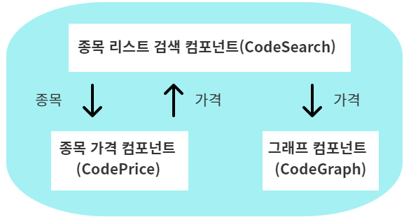

# stock-auto-trading-system  

</a>

</br>

## 전체 시스템의 구성

> **클라이언트**  
> **API 서버 - 수집, 매매**  
> **저장 모듈**                          
> **저장소(MongoDB)**  
(위아래로 인접한 모듈끼리 상호작용 함)  

<-> 홈페이지, 증권사, 공공데이터에서 데이터 가져와서 활용

- 클라이언트 프로그램은 웹을 이용해 사용자에게 화면을 제공  
- 프로그램이 수행된 로직에 의해 최종적으로 데이터가 저장소에 반영됨  
- 수집과 매매를 지원하는 모듈은 매일, 매시, 매분 자동으로 데이터를 수집, 변경함.  

데이터가 이동하는 최종 목적지는 저장소이며, 저장소에 접근하려면 **저장 모듈**을 거쳐서 반영 가능하다.  
> 보안이나 기능적으로 제한된 방법만 허용함으로써 오류를 줄이고 무분별한 요청을 막을 수 있게 처리한다.

외부로 기능을 제공하는 API 역시 저장 모듈을 이용해 저장소에 있는 데이터에 접근하거나 변경할 수 있다.  

최종 클라이언트 프로그램, 웹은 특정한 화면에서 API 서버로 요청을 하게 되며, API 서버로부터 반환받은 데이터를 화면으로 제공하거나 변경한다.  

</br>

## 프로젝트 모듈 구성

</br>

### 1. 수집, 매매 모듈

- 주식 거래와 데이터 분석에 필요한 데이터를 수집하는 모듈  
- 종목의 가격 정보와 종목과 관련된 여러가지 정보 수집
- 주식 관련 거래와 가격 정보는 증권사 API 이용, 매수, 매도할 수 있는 주문 기능 제공
- 증권사에서 얻을 수 없는 정보는 공공데이터와 웹페이지에서 얻어옴  


</br>

### 2. 저장 모듈(데이터의 저장, 변경을 지원)


- 여러 경로로부터 데이터의 저장, 변경, 삭제 요청을 받아서 저장소에 직접 실행하는 모듈  
- 저장소에는 저장 모듈을 통해서만 접근 가능  
- 저장소에 일으키는 명령을 제어하고 로깅하기 쉬우며 무분별한 접근을 차단하고, 공통적인 역할을 손쉽게 처리하기 위해 저장 모듈을 따로 두어 접근하게 설계함  
- MongoDB 사용 - 문서 기반 DB로 스키마가 자유로운 장점이 있으나 복잡한 계산을 요구하는 쿼리는 구현이 복잡해질 수 있음. 하지만 이 프로젝트의 쿼리는 단순하기 때문에 MongoDB를 사용했음  

</br>

### 3. API 서버


- 클라이언트나 웹과 통신하기 위한 API 서버를 구축, API 서버는 외부 클라이언트나 웹이 저장소의 데이터를 이용하기 위한 다리 역할을 한다.  
- UI에서 사용자가 특정 행위를 하면 클라이언트 프로그램은 특정 행위에 해당하는 정보를 API 서버에 요청하고, 그 값을 돌려받은 후 다시 UI에 정보를 갱신해주는 형태로 동작한다.  
- 이렇게 웹이 요청하는 정보를 제공하기 위한 API 서버는 RESTFul 기반으로 진행한다.  

</br>

### 4. 클라이언트(웹)


- API 서버와 통신하며 자동 거래 시스템에 필요한 웹
- 클라이언트 프로그램이 없다면 저장된 데이터를 조회할 때마다 직접 저장소로 들어가서 매번 쿼리를 수행해 필요한 결과를 얻어야 함. 이를 방지하기 위해 웹을 개발함
- 리엑트를 기반으로 개발하며 기본적인 종목 데이터 선택, 데이터 조회, 차트를 지원하는 UI를 웹으로 개발

</br>

### 5. (추가)데이터 분석

- 필요한 데이터를 가공하고 간단한 차트를 그림  

</br>

## 프로젝트 패키지 구성

### 프로젝트 패키지 구조  

```
stocklab ──── agent
│          ├─ db_handler
│          ├─ scheduler
│          └─ tests 
├── scripts
├── 일지
└── README.md
```

- agent : 수집과 매매를 지원하는 모듈
- db_handler : MongoDB에 저장, 변경을 지원하는 모듈
- scheduler : 스케쥴러 모듈(주기적인 작업을 수행하기 위한 모듈)  
- tests : 테스트 파일들이 들어있는 폴더(모듈 아님)  

- scripts: 윈도우의 작업 스케줄러를 이용해 스크립트를 주기적으로 실행한다. 이때 스크립트들이 위한 폴더

(파이썬은 폴더에 있는 __init__.py 파일이 해당 폴더가 패키지임을 알려주는 역할을 한다.)

</br>

### 스케줄러

---

- apscheduler에서 제공하는 BackgroundScheduler를 사용한다.
- 그런데 BackgroundScheduler를 이용해 일반적으로 EBest 모듈을 호출하게 되면 정상적으로 동작하지 않는다.
> EBest가 win32com 패키지를 사용하면서 내부적으로 프로세스와 관련된 동작을 하는데 이때 BackgroundScheduler에서 win32com이 정상적으로 호출되지 않는다.

- 이를 해결하기 위해 멀티프로세싱으로 별도의 프로세스를 하나 더 생성해서 EBest 모듈을 수행한다.

1. Scheduler에서 job1과 job2 생성

2. job1은 종목 코드를 가져오는 run_process_collect_code_list 메서드를 호출하고, job2는 종목별 가격 정보를 가져오는 run_process_collect_stock_info 메서드를 호출한다.

3. run_process_collect_code_list는 collect_code_list를 호출해 프로세스를 생성하고, collect_stock_info도 별도의 프로세스를 생성한다.

4. 개별 프로세서는 ebesst와 mongodb 객체를 생성해 종목 코드를 수집하고, 종목별 가격 정보를 수집한다.

작업을 수행할 시간을 지정할 때 크론(cron) 방식을 사용한다.

```
크론(cron) 방식

*  *  *  *  *
분 시 일 월 요일

*은 매 분, 매 시, 매일 등 매번을 의미

*/5 * * * * : 매 5분 단위를 의미

25, 45 * * * * : 매시간 25분, 45분 의미

0 6 * * 1-3 : 월,화,수요일 6시를 의미
```

</br>

### 트레이딩 모듈

---

- 구현할 동작 시나리오  

```
스케줄러 동작

     │  
     ᐯ     

보유 종목(or 관심종목)    

     │  
     ᐯ   
                 Y
매수주문 체결   ─────>   매수 완료   ─────>    매수가 +10 호가 매도 주문

     │  
     ᐯ   
                 Y
보유 수량 == 0  ─────>   현재가 매수 주문

     │  
     ᐯ   
                 Y
매도주문 체결   ─────>   매도 완료

     │  
     ᐯ   

    완료
```

1. 시작은 스케줄러에 의해 동작한다.  

2. 관심 종목(또는 보유 종목)에 매수 주문이 있는 경우 [매수 주문 체결] 단계에서 현재 매수 주문이 체결 상태인지 확인하고, 매수 주문의 상태가 체결 상태이면 [매수 완료]로 상태를 변경한 다음 [매수가 +10 호가로 매도 주문]을 한다.

3. 매수 주문이 체결되지 않았거나 보유 수량이 없다면 [현재가 매수 주문]을 한다. 보유 수량이 있을 때에는 매도 주문이 체결됐는지 확인한다.

매수 완료, 매수 주문, 매도 주문, 매도 완료 단계에서는 각 단계의 정보를 MongoDB에 저장한다.  

최종적으로 거래 정보가 DB에 저장되는 형태는 다음과 같다.  

```
{
     "code": "005930",
     "status": "sell_completed",
     "매수주문": {
          ...
     }, 
     "매수완료": {
          ...
     }, 
     "매도주문": {
          ...
     },
     "매도완료": {
          ...
     }
}
```

- code에는 종목 코드가 저장되며 status는 단계별로 상태가 저장된다.  

</br>

### 백테스팅
---  

- 과거 데이터로 트레이딩 시스템의 성능을 평가하는 것을 백테스팅이라 한다.
- 알고리즘의 성능을 평가해 볼 수 있는 기준이 된다.  
- 전통적으로 백테스팅에 많이 사용되는 파이썬 오픈소스로는 zipline이 있으나 여기서는 이베스트에서 제공하는 xingACE를 쓴다.  

#### 백테스팅 방법
1. 과거 데이터를 조회하기 위한 API 구현
2. 구현한 API를 이용해 1분 단위로 가격 정보를 얻음
3. 가격 정보를 이용해 매수, 매도 주문

- 각 분마다 가져온 가격 정보를 매수, 매도 주문의 가격과 비교해서 주문이 체결되면 주문이 완료되도록 처리한다.  
- 트레이딩 로직을 수행한 결과와 체결된 정보를 이용해 수익을 계산한다.  

</br>

### REST API
---  

REST란
- Representational State Transfer  
- 자원(Resource)을 정의하고 자원에 대한 주소를 지정하는 방법의 설계  

#### REST API 디자인  

종목 정보와 관련있는 API는 CodeList와 Code이다. 이 두 메서드는 GET 방식만 허용하며 전체 주식 종목 리스트와 개별 종목에 대한 정보를 반환한다.  

|자원|URI|GET|
|-|-|-|
|주식 종목 리스트(CodeList)|/codes|모든 주식 종목 코드를 조회|
|개별종목(Code)|/codes/&#60;code>|&#60;code> 종목 코드의 정보를 조회|
|개별 종목 가격(Price)|/codes/&#60;code>/price|&#60;code> 종목 코드의 가격 정보를 조회|
|주문 리스트(OrderList)|/orders|모든 주문 정보 조회|
|개별 주문(Order)|/orders/&#60;id>|개별 주문 정보 조회|  

#### Flask
- Flask를 활용해 REST API 서버를 구현한다.  
- Flask는 웹 개발을 위한 마이크로프레임워크이다.  
- REST 디자인을 도와주는 Flask-Restful도 함께 설치한다.  


### React  
---

- 선언형 라이브러리

일반적인 C, 자바, 파이썬과 같은 프로그램은 명령형 프로그래밍 언어로 무엇을 실행해야 하는지 정의한 다음 알고리즘이나 로직을 개발자가 작성한다.  

하지만 선언형 언어는 명령형 프로그래밍 언어와 달리 어떻게 실행하는지보다는 무엇을 표현해야 하는지에 초점을 맞추고 개발자가 이를 정의하는 방식이다.  

HTML을 예로 들면 개발자는 화면에 무엇을 표현해야 하는지를 정의한다. 정의는 태그를 이용하며 정의한 태그를 브라우저가 읽어들여 HTML 규칙에 맞게 화면에 표시한다.  

HTML과 유사하게 React 역시 무엇을 그려야 하는지 선언하는 선언형 라이브러리이다. HTML과 다른 점은 그려야 할 컴포넌트가 속성과 상태를 갖고 있으며, 속성과 상태에 따라 그려지는 화면이 달라진다는 점이다.  

- 컴포넌트 기반 라이브러리  

React는 컴포넌트 기반의 라이브러리다. React로 개발하는 대부분은 컴포넌트가 된다.  

컴포넌트는 버튼처럼 작은 단위가 될 수도 있고, 여러 컴포넌트를 포함하는 복잡한 컴포넌트일 수도 있다. 컴포넌트의 포함 범위는 개발자가 결정한다.  

React는 컴포넌트 단위로 화면에 그리기 때문에 너무 많은 컴포넌트를 하나로 결합하면 화면의 넓은 부분을 다시 그려야 할 수도 있다.  

따라서 적절한 단위로 컴포넌트를 나눠야 한다. 이번 프로젝트에는 다른 개발자들이 만들어둔 컴포넌트를 가져다 썼다.  

추가적으로 디자인을 위해 구글에서 제공하는 Material UI 컴포넌트도 사용한다. Material UI는 디자인의 구성과 관련된 콘셉트를 React의 컴포넌트로 제공한다.  

- React 메인 컨셉  

> **컴포넌트 구성**  
> **JSX와 렌더링**  
> **Props와 컴포넌트**  
> **이벤트 핸들링**  
> **리프팅 스테이트 업**  

- 개발 화면 디자인은 카카오 오븐을 이용했다.  

</br>

- 종목정보(Codeinfo) 페이지와 컴포넌트 구성



종목 정보 페이지는 종목 리스트검색, 종목 가격, 그래프 컴포넌트를 포함하고 있다.  

종목 리스트 검색 컴포넌트에서 종목을 선택하면 종목 가격 컴포넌트에서 가격 정보를 로딩하며, 로딩한 가격 정보는 다시 그래프 컴포넌트로 전달해 그래프를 그리는 방식이다.  

차트를 그리는 컴포넌트는 recharts 라이브러리를 사용한다.  


### 후기

---

회사에서 인턴을 하는 동안 틈틈히 진행한 프로젝트라 엉성하다.  

몇 가지 아쉬운 부분이 있다.  

1. 이베스트 API에서 1초에 1개씩밖에 쿼리를 날리지 못한다는 점.. 그로 인해 price 쿼리를 가져올 때 너무 많은 시간이 걸린다는 점  

2. 1번과 비슷하게 시간당 쿼리 제한이 너무 강하다. 10분에 200개라니.. 역시 price 쿼리를 가져올 때 너무 많은 시간이 걸린다.  

3. 그로 인해 막상 client에서 원하는 주식을 클릭하면 막상 데이터가 나오는 항목이 별로 없다..  

4. 스케줄러 열심히 작성했는데.. 막상 회사 컴에서는 작동하지 않는다.. 그래서 작성하나마나가 되었다.. 

그래서 막상 client를 눌러보면 얻을 수 있는 정보가 적다는 점이 너무 아쉽다.  

그래도 혼자서 적은 시간동안 진행한 토이 프로젝트 치고는 꽤 다양한 부분을 다루었고 나름 기능별로 잘 구분하여 설계하고 구현한 것 같다.  

